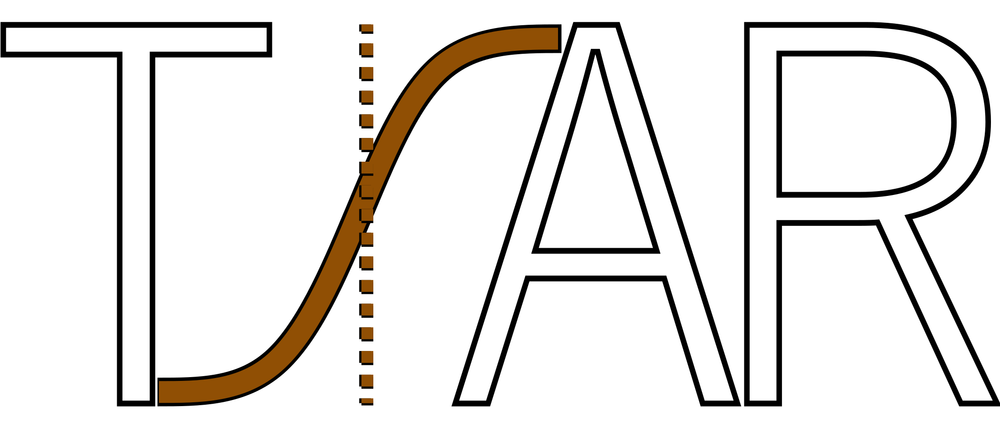

```{r, include = FALSE}
knitr::opts_chunk$set(warning = FALSE, message = FALSE, comment = "#>")
```
```{r, echo=FALSE, fig.width=4, out.width="400px"}

```

```{r setup}
library(TSAR)
```

## FAQ

-   What are required dependencies?

    Load `Shiny` separately if running shiny applications. Load `ggplot2` and 
    `plotly` if intending to modify automated graphs.

-   How are Tm values estimated?

    TSAR package estimates uses derivative method by locating maximum first 
    derivative. Errors may occur during the process, edit estimation with 
    caution if errors were perceived.

-   Are smoothing applied to data, what kind?

    TSAR package utilizes `gam` function from package `mgcv`. Model assumes 
    `method = "GACV.Cp"` and sets to `formula = y ~ s(x, bs = "ad")`. Smoothing 
    may be toggled off by specifying parameters. Refer to function 
    documentations for instructions.

-   Got new suggestions or unmentioned-problems?

    Start a new issue in our github repository: `"CGAO123/TSAR"`

## Verify Data Input

TSAR package processes large amounts of data of similar properties, it is easy 
to confuse one with another and fail analysis. Verify your data input and out 
here by check for variable names. Consider renaming your data frame to theese 
following if issues are encountered.

-   raw_data

    -   required:

        -   Temperature (double)

        -   Fluorescence (double)

        -   Well.Position (character)

-   norm_data

    -   required:

        -   Temperature (double)

        -   Fluorescence (double)

        -   Well.Position (character)

    -   generated by tsar:

        -   norm_deriv (double)

        -   tm (double)

-   tsar_data

    -   required:

        -   Temperature (double)

        -   Fluorescence (double)

        -   Well.Position/Well (character)

        -   norm_deriv (double)

        -   Tm (double)

        -   Protein (character)

        -   Ligand (character)
        
    -   generated by tsar:

        -   ExperimentalFileName (character)

        -   well_ID (character)

        -   condition_ID (character)

For more detailed examples, refers to vignettes, `TSAR_Package_Structure` 
and `TSAR_Workflow_by_Command`.

## Locating Appropriate Function Calls

Given the two available workflows, here is a list of corresponding shiny 
functions and relative command line functions.

#### Under Data Pre-Processing, weed_raw():

-   View Selected; `TSAR::screen()`

-   Remove Selected; `remove_raw()`

#### Under Data Analysis, analyze_norm():

-   View Model Fit; `view_model()`

-   Analyze all Wells; `gam_analysis()`

    -   function wraps together, `normalize()`, `model_gam()`, 
    `model_fit()`, `Tm_est()`

-   Upload Well Information & Set Conditions; `join_well_info()`

-   Manual Input; load template using `data("well_information")`

    -   edit empty template by writing file into local end, `write.csv()`

-   Save File; `write_tsar()`, `read_tsar()`

#### Under Data Visualization, graph_tsar():

-   Merge Replicate Trials; `merge_norm()`

-   Generate Boxplot; `TSA_boxplot()`

-   Generate Compare Plots; `TSA_compare_plot()`

-   Graph Selected Curves; `TSA_wells_plot()`

-   Compare Derivatives; `view_deriv()`

-   List Condition IDs; `condition_IDs()`

-   List Well IDs; `well_IDs()`

-   List Tms; `TSA_Tms()`

-   List Delta Tms; `Tm_difference()`

## Session Info

```{r}
sessionInfo()
```
