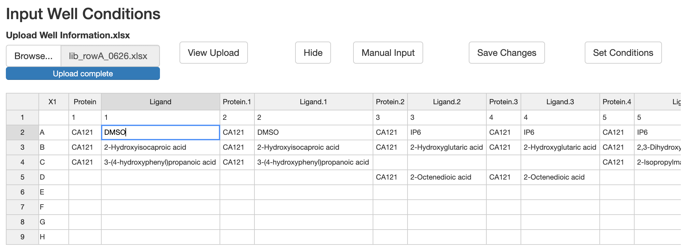
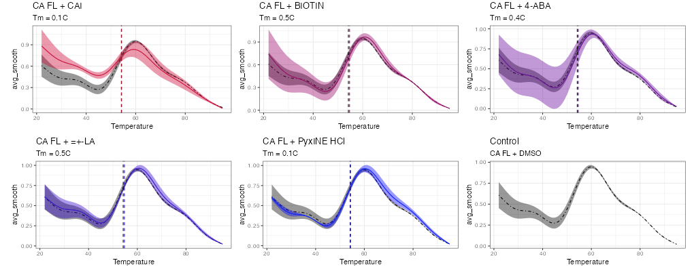
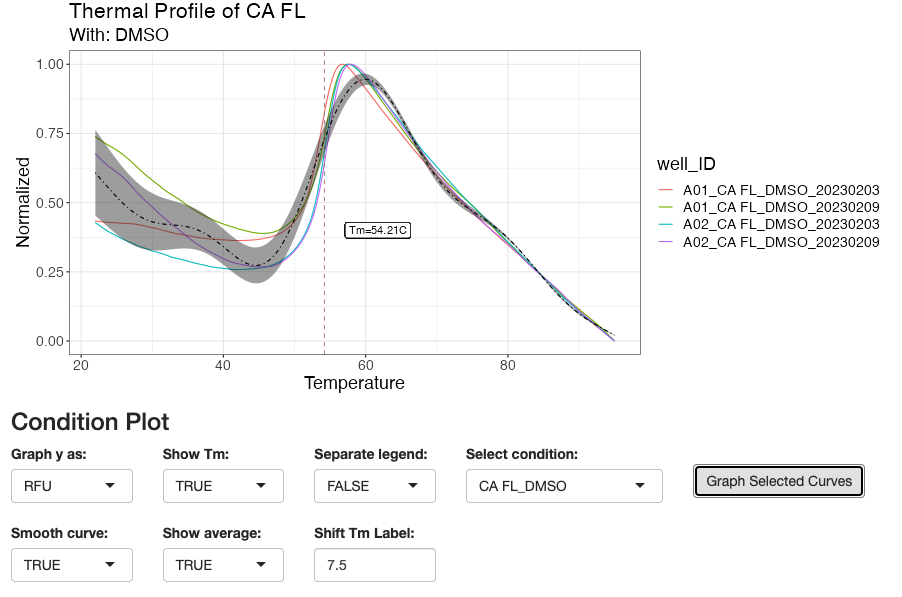

```{r, include = FALSE}
knitr::opts_chunk$set(
  collapse = TRUE,
  comment = "#>"
)
```

```{r setup}
library(TSAR)
```

TSAR Package is wrapped within a three separate shiny application regarding, data pre-processing, data analysis, and data visualization. All application can be opened in both interactive window or browsing engine by copy pasting server address into web browser.

## Data Pre-Processing

Load data and remove blank wells by specifying a range of wells with `removerange = c()` or individual wells with `removelist = c()`. User may also use function `weed_raw()` to open Shiny application to screen all raw curves and remove by curve selection. To propagate change to data to local change, click `Copy Wells` or `Copy Selcted in Full Function Call` and directly run copied command.

```{r, eval = FALSE}
data("qPCR_data1")
qPCR_data1 <- remove_raw(qPCR_data1, removerange = c("B", "H", "1", "12"))
weed_raw(qPCR_data1)
```

In the plot panel, user can interact with graph and select data by clicking on curves. User may also `View Selected` wells only and `Remove Selected`. To return to default page and current all change to data set, click `Refresh Screening`. To propagate the same changes to local data set, click `Copy Selected in Full Function Call` to copy a `remove_raw()` call containing all selected wells into clipboard. Paste the call back into console or script and run to propagate changes locally. p.s. It is recommended to remove large areas of blank wells before calling `weed_raw()` to boost speed of application.

```{r, out.width = "400px", echo = FALSE}
knitr::include_graphics("images/weed_raw.png")
```

## Data Analysis

Analyze data by calling function `analyze_norm()` and follow the workflow from top to bottom. Preview data table for changes occurring at each step and refer to graph to view fit of model. Always refer to the message bar below table and graph for hints and error references. A success message will also be prompted after each successful run of step.

Remember to save analysis output locally by clicking `Save File`. Always preview data before saving to ensure data contains all necessary information.

```{r, eval = FALSE}
analyze_norm(qPCR_data1)
```

The top left panel output a preview of current data set. The right panel allows user to view the fit of model and Tm estimation by individual wells of selection. Once confirming correct data input and modeling effects, click `Analyze all 96 Wells` to propagate model and analysis onto the rest of data. A preview of analyzed data will also be shown on the left panel once analysis is complete.

```{r, out.width = "400px", echo = FALSE}
knitr::include_graphics("images/analyze_norm.png")
```

Upload well information by excel template and preview to confirm if information is correct. Click `Set Conditions` to connect all data to the conditions. A success message should be prompted in the message bar. Lastly, to save all analysis locally, click `Save File` after previewing output. p.s. make to select `both` under `Choose dataset` if intending to use `graph_tsar()` or other graphing tools within the package.

```{r, out.width = "400px", echo = FALSE}

```

## Data Visualization

Use function `graph_tsar()` to start a Shiny application for graphing options. Run `na.omit()` on data if error occurs. Three graphing options are allowed, boxplot of Tm, compare plots, and conditions plot.
 
Function takes optional data parameter. If analysis file is already imported in the environment, call function as `graph_tsar(tsar_data)`. Else, user may use the merge data panel to upload and merge data of all test trials. Simply call `graph_tsar()` and click `Upload and Merge Data` button to reveal the panel to merge data.
```{r, eval = FALSE}
graph_tsar()
```

```{r, out.width = "400px", echo = FALSE}
knitr::include_graphics("images/analyze_norm_0.png")
```


Top panel outputs all plots, selected desired graphing features below and click generate to output graphs. p.s. Graphing compare plots and selected curves are takes longer than boxplot, please give it few seconds to load.

```{r, out.width = "400px", echo = FALSE}
knitr::include_graphics("images/graph_tsar.png")
```

```{r, out.width = "400px", echo = FALSE}


```

\
