```{r, include = FALSE}
knitr::opts_chunk$set(warning = FALSE, message = FALSE, comment = "#>")
```
```{r, echo=FALSE, fig.width=4, out.width="400px"}
knitr::include_graphics("images/TSAR_logo.png")
```
## 1. Introduction
TSAR, short for Thermal Shift Analysis in R, provides simple solution to qPCR 
data processing, computing thermal shift analysis given either raw fluorescent 
data or smoothed curves. 
The functions provide users with the protocol to conduct preliminary data checks
and also expansive analysis on large scale of data. Furthermore, it showcases 
simple graphic presentation of analysis, generating clear box plot and line 
graphs given input of desired designs. Overall, TSAR Package offers a workflow
easy to manage and visualize.
TSAR Package is wrapped within a three separate shiny application regarding, 
data pre-processing, data analysis, and data visualization. All application 
can be opened in both interactive window or browsing engine by copy pasting 
server address into web browser.

## 2. Installation

## 3. Load TSAR Package
Use commands below to install TSAR package:
library(BiocManager)
BiocManager::install("TSAR")

```{r setup}
library(TSAR)
library(shiny)
```


## 4. Data Pre-Processing

Load data and remove blank wells by specifying a range of wells with 
`removerange = c()` or individual wells with `removelist = c()`. User may 
also use function `weed_raw()` to open Shiny application to screen all raw 
curves and remove by curve selection. To propagate change to data to local 
change, close window properly by clicking `Close Window`. The updated data 
set will be stored in the global environment as `new_raw_data`.

```{r}
data("qPCR_data1")
qPCR_data1 <- remove_raw(qPCR_data1, removerange = c("B", "H", "1", "12"))
```
```{r, eval = FALSE}
runApp(weed_raw(qPCR_data1))
```

In the plot panel, user can interact with graph and select and un-select 
data by clicking on curves. User may also `View Selected` wells only and 
`Remove Selected`. To return to default page and current all change to 
data set, click `Refresh Screening`. To propagate the same changes to 
local data set, simple click`Close Window`. Else, click `Copy Well IDs` 
or `Copy Selected in Full Function Call` to copy a `remove_raw()` call 
containing all selected wells into clipboard. Paste the call back into 
console or script and run to propagate changes locally. 
p.s. It is recommended to remove large areas of blank wells before calling 
`weed_raw()` to boost speed of application.

```{r, out.width = "400px", echo = FALSE}
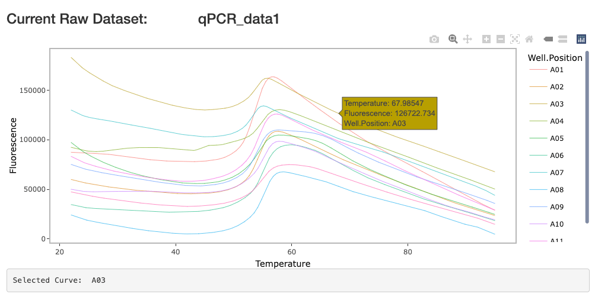
```

Selection by grid is also possible; click on grid to highlight wells of 
selection. Click again to un-highlight. Click too fast may lead to error due to 
speed of reaction, use `Clear All Selected` button at the top of page to reset 
selection. Note that clearing selections alters to-be-copied selections, but 
will not restore curves already removed in the graph. However, changes are not 
made permanently. If erroneously removed, simply close and reopen window to 
run again.

```{r, out.width = "400px", echo = FALSE}

```

Use `View Selected` and `Remove Selected` to view and remove selection. To 
return to viewing rest of the data, click `Refresh Screening`. To propagate the 
same changes to local data set, click `Copy Selected in Full Function Call` to 
copy a `remove_raw()` call containing all selected wells into clipboard. Paste 
the call back into console or script and run to propagate changes locally.
```{r, out.width = "400px", echo = FALSE}
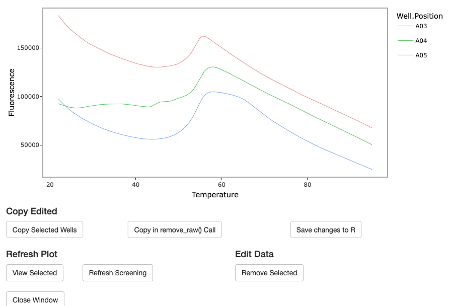
```

## 5. Data Analysis

Analyze data by calling function `analyze_norm()` and follow the workflow from 
top to bottom. Preview data table for changes occurring at each step and refer 
to graph to view fit of model on each well. Always refer to the message for 
hints and error references. A success message will also be prompted after each 
successful run of step.

Remember to save analysis output locally by clicking `Save File`. Always 
preview data before saving to ensure data contains all necessary information.

```{r, eval = FALSE}
runApp(analyze_norm(qPCR_data1))
```

The top left panel output a preview of current data set. The right panel allows 
user to view the fit of model and Tm estimation by individual wells of 
selection. Once confirming correct data input and modeling effects,

```{r, out.width = "400px", echo = FALSE}
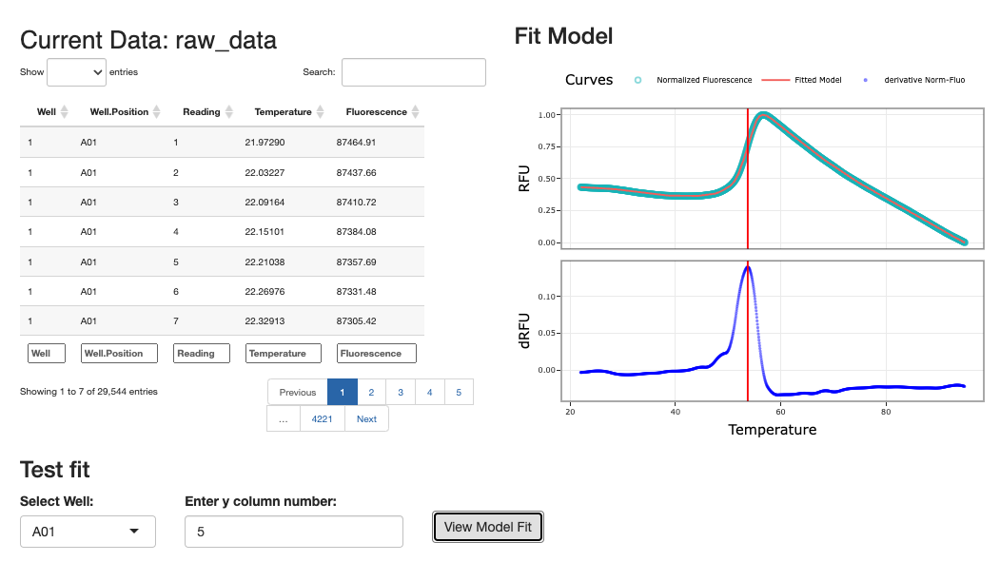
```

Click `Analyze all Wells` to propagate model and analysis onto the rest of data.
A preview of analyzed data will also be modeling and analyzing all 96 Wells will
take between 30 to 50 seconds. If no modeling are needed, given data are 
smooth enough, analysis of all 96 wells should be completed under 5 seconds. 
p.s. actual time length many subject to change under different conditions

```{r, out.width = "400px", echo = FALSE}
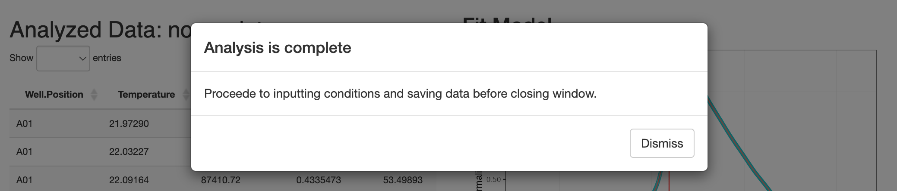
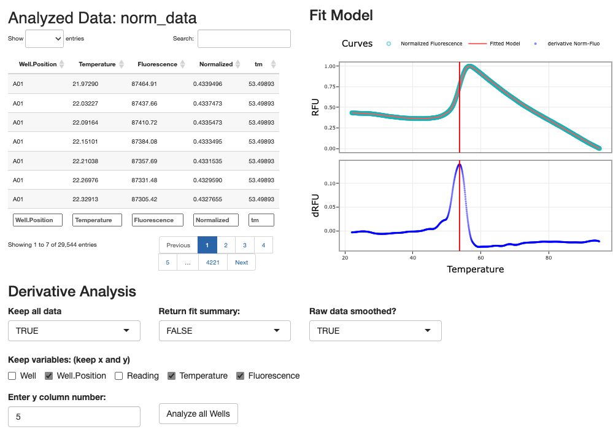
```

Upload well information by excel template and preview to confirm if information 
is correct. Use `Preview` to preview uploaded information and directly edit 
inside the window. User may also choose `Manual Input` to put in all condition 
information by Well. Make sure to hit `Save Changes` after editing and click 
`Set Conditions` to link all data to the conditions. A success message should 
be prompted.
p.s. manually inputted information will override file upload. If mistakenly 
saved, please close window and re-run command.

```{r, out.width = "400px", echo = FALSE}
knitr::include_graphics("images/analyze_norm2.png")

```

```{r, out.width = "400px", echo = FALSE}

```

Lastly, to save all analysis locally, click `Save File` after previewing output.
p.s. make to select `both` under `Choose dataset` if intending to use 
`graph_tsar()` or other graphing tools within the package.

## 6. Data Visualization

Use function `graph_tsar()` to start a Shiny application for graphing options. 
Run `na.omit()` on data if error occurs. Four graphing options are allowed, 
boxplot of Tm, compare plots, and conditions plot.

Function takes optional data parameter. If analysis file is already imported 
in the environment, call function as `graph_tsar(tsar_data)`. Refer to vignette 
"TSAR Workflow by Command" for instructions on how to merge using function 
`merge_norm()`. Else, user may use the merge data panel to upload and merge 
data of all test trials. Simply call `graph_tsar()` and click 
`Upload and Merge Data` button to reveal the panel to merge data.

```{r, eval = FALSE}
runApp(graph_tsar())
```

Upload is limited to 30MB in size, but not count. After upload, user will 
be prompted corresponding numbers of input boxes to specify date of each 
experiment. Click `Save Dates`, then `Merge and Save Data`. A short preview 
of tsar_data will be prompted. For full lists and filters of well_ID and 
conditions_ID, refer to the helper buttons at the bottom of page.

```{r, out.width = "400px", echo = FALSE}

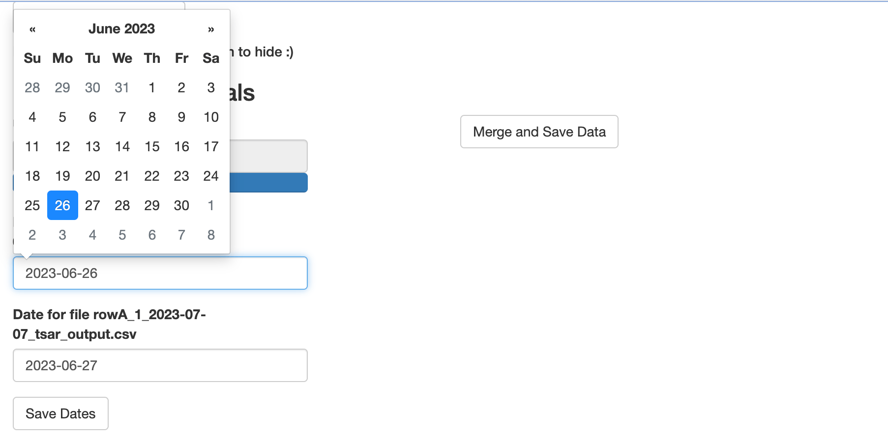


```

Top panel outputs all plots, selected desired graphing features below and click 
generate to output graphs. p.s. Graphing compare plots and selected curves are 
takes longer than boxplot, please give it few seconds to load.

Boxplot has the option to be loaded interactive. Note interactive graphs have 
to be produced with legend combined.

```{r, out.width = "400px", echo = FALSE}
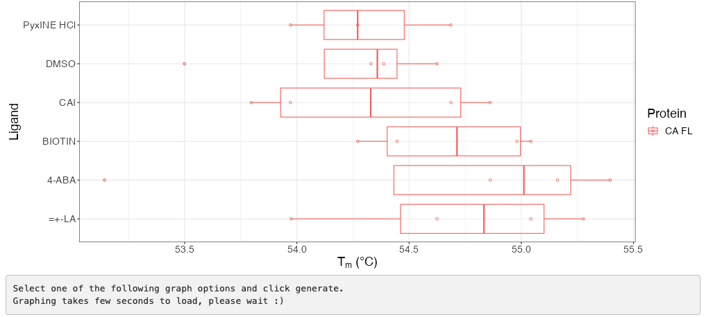
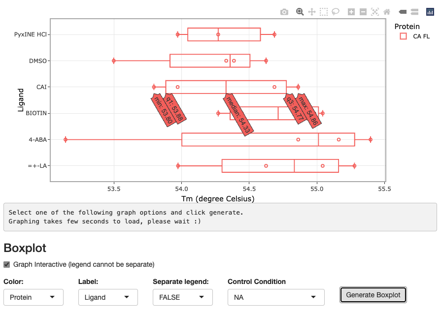
```

```{r, out.width = "400px", echo = FALSE}
knitr::include_graphics("images/graph_tsar2.png")
```

Generating compare plots will output all plausible comparisons by control. To 
any specific one, a drop list `View Only:` will be prompted below the button 
`Generate Compare Plots`. Select by condition_ID to zoom in on graphs.

```{r echo=FALSE, out.width="400px"}
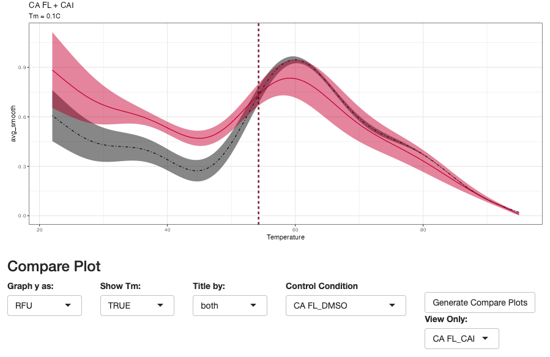
```

```{r, out.width = "400px", echo = FALSE}
knitr::include_graphics("images/graph_tsar3.png")
```

Compare plots for first derivative graphs are interactive graphs grouped by 
specified variable.
```{r, out.width = "400px", echo = FALSE}
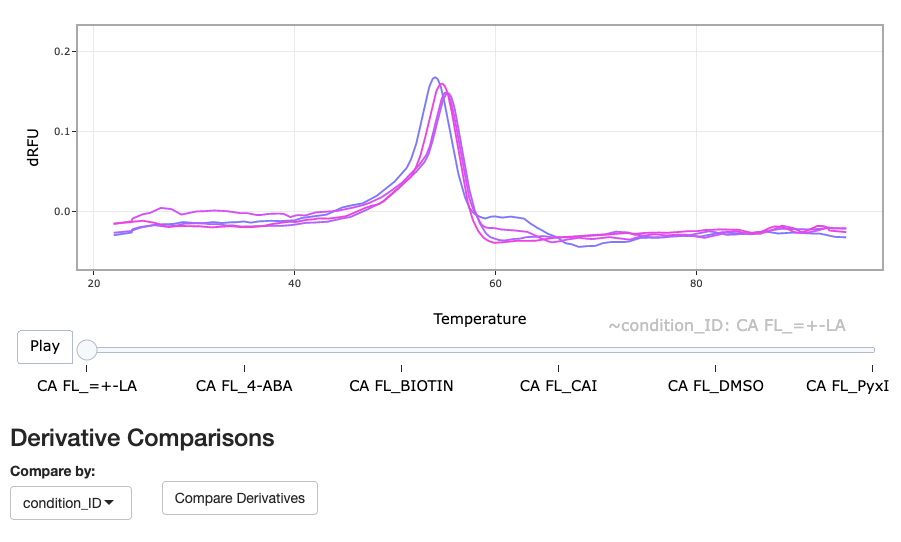
```

Helper functions include these following:

```{r, out.width = "400px", echo = FALSE}
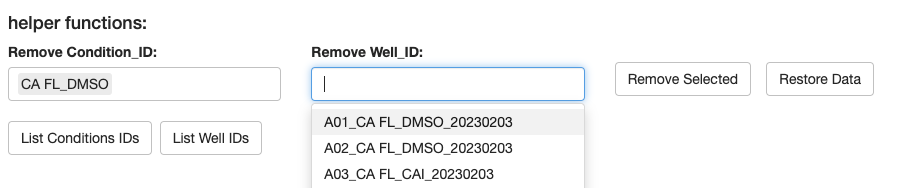
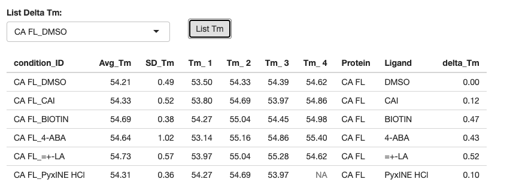
```

## 7. Session Info

### 7.1 Citation
```{r}
citation("TSAR")
citation()
citation("dplyr")
citation("ggplot2")
citation("shiny")
citation("utils")
```

### 7.2 Session Info
```{r}
sessionInfo()
```
